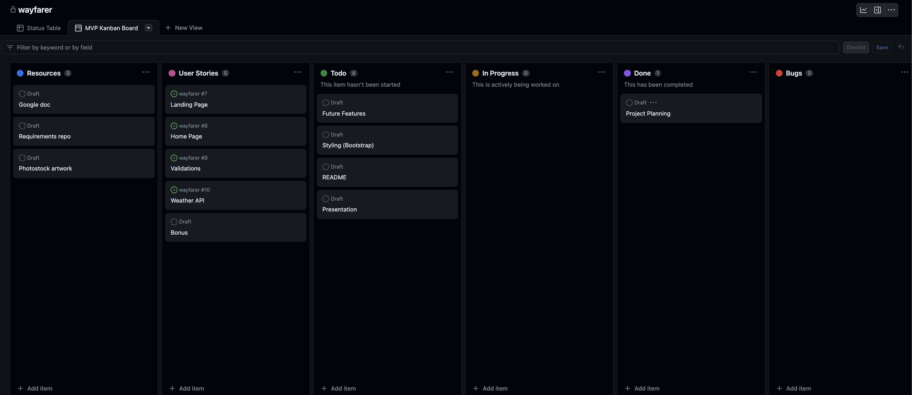
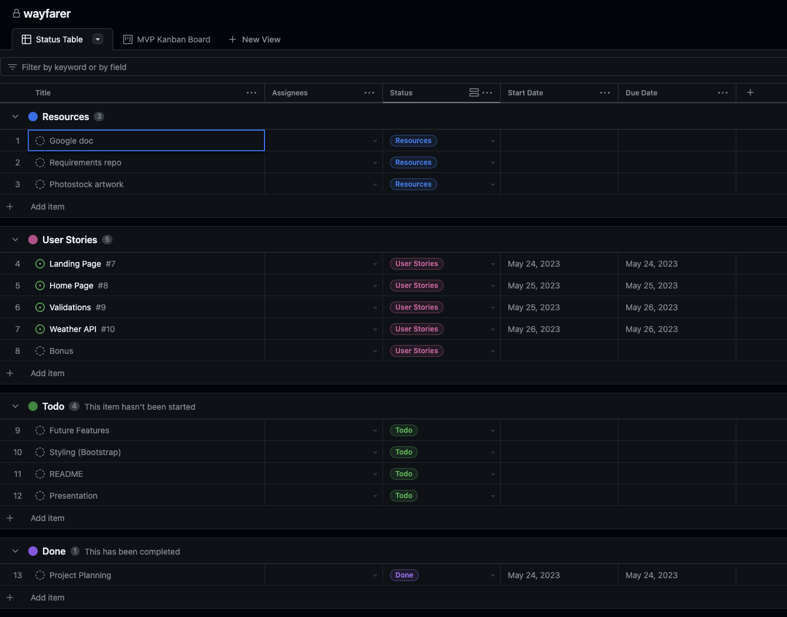

# Wayfarer - Your Choice of Travel Partners

Worry Free Travel

## Tables of Contents

- [Project Overview](#project-overview)
- [Project Planning](#project-planning)
- [User Stories](#user-stories)
- [MVP](#mvp-------completed-------not-completed)
- [Favorite Parts](#favorite-parts)
- [Wins & Hurdles](#wins--hurdles)
- [Technologies & Tools](#technologies--tools)
- [Credits](#credits)

***

## Project Overview

This was a group project which consisted of 3 group
members [Kim Nguyen](https://www.linkedin.com/in/knnguyen2410/), [Trevor Hendricks](https://www.linkedin.com/in/t-hendricks/) & [Pamela Afaneh](https://www.linkedin.com/in/pam-afaneh/).
The goal of the project was to create a travel community site, built in Angular and connected to a weather API service.  The user stories and wireframes were provided, which was 
to allow us to full fill a clients requirements for this project.

## Project Planning

### Progress Snapshot 1

  

### Progress Snapshot 2

  

[View Planning Kanban Board](https://github.com/users/t-hendricks/projects/6)

***
## User Stories

#### <ins>Sprint 1</ins>

- As a user, I should be able to navigate to "/" to see a basic splash page with the name of the website 
- As a user, I shoyuld be able to see the site-wide header on every page with a link to the home page and list of cities.

#### <ins>Sprint 2</ins>

- As a user, I should be able to view the "San Francisco" page (at "/cities/1") including 
  <ul>
  <li>A site-wide header</li>
  <li>The name of the city</li>
  <li>An iconic photo of the city</li>
  </ul>
- As a user, I should be able to view a list of posts on the San Francisco page. 
  <ul>
  <li>Sorted by newest first</li>
  <li>WIth the post titles linked to the individual post "show" pages</li>
  </ul>
- As a user, I should be able to use the search bar to search through the posts title and /or content. 
- As a user, I should be able to click on the title of one of their posts and be redirected to a "show" page for that post. 
- As a user, I should be able to view posts "show" pages with title, author, and content. 

#### <ins>Sprint 3</ins>

- As a user, I should be able to view city pages for "London" and "Gibraltar".
- As a user, A post's title must be between 1 and 200 characters.
- As a user, A post's content must not be empty.

#### <ins>Sprint 4</ins>

- As a user, I should be able to call open Weather API for each city to diplay the current weather on each cities page.

***

## MVP ( - ✓ - Completed / - ✗ - Not Completed)

1. Should consist of 3 models. - ✓
2. The environment settings should be using Spring Profiles. - ✓
3. Use a combination of Spring Security and JWT Tokens. - ✓
4. The routes should be protected by JWT except for login/register. - ✓
5. A minimum of 1 REST API point that is fully CRUD operable. - ✓
6. API endpoints must be able to perform CRUD based on business use-case. - ✓
7. Provide CRUD routes that were built based on rest conventions to be a part of the API. - ✓
8. Have graceful exception handling in place. - ✓
9. In the event that an exception occurs, you should send error message to user. - ✓
10. Code on different branches during development. - ✓
11. Utilize KISS & DRY Principals. - ✓
12. Write code that is test driven with TDD Approach. - ✓
13. Unit test the controller & service classes with MockMVC. - ✓
14. Write Doc Strings for each method. - ✓
15. Provide REST Endpoints. - ✓

***

## Favorite Parts

<ins><b>Jeff's</b></ins> favorite part was reaching the MVP milestone and successfully completing the project. 

<ins><b>Wanda's</b></ins> favorite part was overcoming testing challenges and seeing the tests pass upon completion. 

<ins><b>Pam's</b></ins> favorite part was being a part of this team, as it provided her with valuable learning
opportunities. 

***

## Wins & Hurdles

#### <ins>Wins</ins>

Through collaboration, we reached a consensus on the following list, which we proudly consider to be our wins for this
project.

- We each acquired valuable experience and knowledge while conducting pair programming.
- We recognize the importance of efficient time management when collaborating with a team.
- We developed the ability to effectively prioritize user stories, enabling us to successfully reach the Minimum Viable
  Product (MVP).
- We are proud of the significant progress we made within the set timeframe we had.

#### <ins>Hurdles</ins>

As a team, we encountered the following list of hurdles during this project.

- <b>Working as a team with varying levels of experience:</b> We faced the challenge of leveraging each team member's
  strengths and effectively assigning tasks accordingly.

- <b>Testing controllers without authentication:</b> One of our obstacles was finding a way to test the
  controllers without the need for authentication.

- <b>Project management using Git:</b> We encountered difficulties in managing the project collaboratively using Git.
   

***

## Technologies & Tools

- Java
- Spring Boot
- JWT
- Postman
- GitHub Project
- Draw.io
- H2 Database
- JUnit
- Mockito

***

## Credits

- We utilized this [tool](https://app.diagrams.net/) for creating ERD
diagrams - [Google Diagrams](https://app.diagrams.net/) 
- We were inspired by [Spotify](http://spotify.com) for our app.

### Jeff
- A huge thanks to [Suresh](https://github.com/sureshmelvinsigera), [Dhrubo](https://www.linkedin.com/in/dhrubo-hasan/) and [Leo](https://www.linkedin.com/in/leonardo-rodriguez/?lipi=urn%3Ali%3Apage%3Ad_flagship3_people_connections%3BiDOQ1nARTqWp8%2BgRo7bF6Q%3D%3D) who shared their feedback and suggestion at the beginning of the project
- Shout-out to my teammates for their patience, kindness, and hard work during the development of the project

### Pam
- I would like to thank Jeff for taking charge on this project with his stellar ability of planning and management.  
- I would like to thank both team members for their patience and help, it was a true pleasure working with both of you
